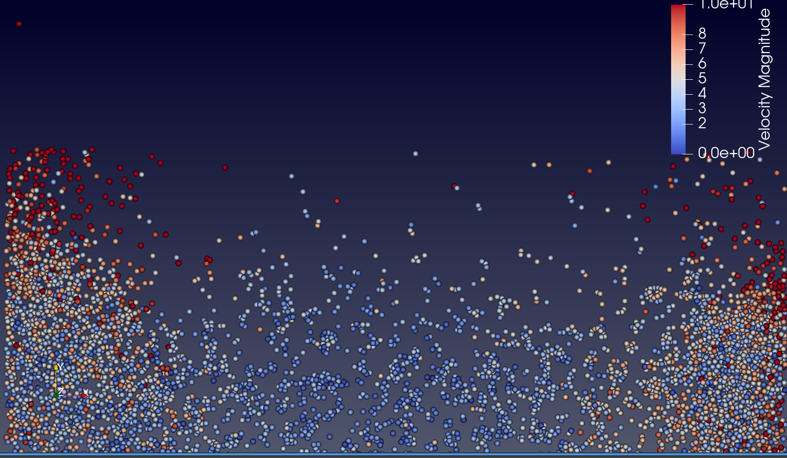

# Particle system

This project enables you to create and visualize particle systems in C++. With our framework, you can easily generate stunning visualizations in VTK format.

#### To compile and execute: 
    cd build 
    cmake .. 
    make 
    ./test/<test_name>

